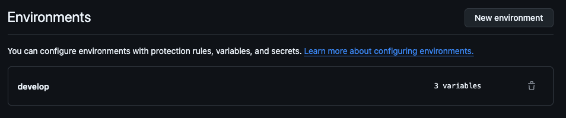
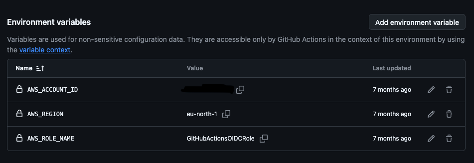

# AWS CDK Project Init

AWS CDK Project Init is a skills-only Codex plugin that creates a standardized AWS CDK TypeScript project from the pinned Traceability `v1.0.4` starter. It renames generated files, classes, tests, package metadata, and stack identifiers to match the requested project name, installs dependencies, and verifies the build and tests.

Created and published by Lars Andersson. The Traceability starter project is also created by Lars Andersson.

## What it does

- Creates a new project in an empty directory.
- Uses the immutable Traceability `v1.0.4` tag.
- Normalizes filenames and TypeScript identifiers from the project name.
- Runs `npm install`, the TypeScript build, and Jest tests.
- Explains optional GitHub Actions deployment prerequisites.

## Requirements

- Codex with skill/plugin support
- Bash
- Git
- Node.js with npm and npx
- Public access to GitHub and the npm registry

## Install from GitHub

Add the public repository as a Codex marketplace, then install the plugin:

```bash
codex plugin marketplace add zipon/init-project-skill --ref main
codex plugin add aws-cdk-project-init@init-project-skill
```

Restart the ChatGPT desktop app after installation and begin a new task so the installed skill is discovered.

You can also download the [`v1.0.0` OpenAI skill bundle](https://github.com/zipon/init-project-skill/releases/download/v1.0.0/init-aws-cdk-project-skill-1.0.0.zip), the [`v1.0.0` complete plugin](https://github.com/zipon/init-project-skill/releases/download/v1.0.0/aws-cdk-project-init-plugin-1.0.0.zip), or the [current source ZIP](https://github.com/zipon/init-project-skill/archive/refs/heads/main.zip). Release-ready archives can be regenerated by the repository's `scripts/package.sh` command and GitHub validation workflow.

## Example prompts

- `Create an AWS CDK project named MyProject.`
- `Initialize OrderService from the Traceability starter.`
- `Create a CDK project and explain optional GitHub Actions OIDC setup.`

## Optional automatic deployment through GitHub Actions

The AWS OIDC setup is needed only when the generated project will deploy automatically through GitHub Actions. It is not required to initialize, build, test, or work with the project locally.

For automatic deployment, create or confirm an AWS IAM OIDC role named exactly `GitHubActionsOIDCRole`. Configure the GitHub Environment with `AWS_ACCOUNT_ID`, `AWS_REGION`, and `AWS_ROLE_NAME=GitHubActionsOIDCRole`, restrict the role trust policy to the intended repository and environment, and use short-lived credentials with `id-token: write`.





The account ID in the example is intentionally redacted. Do not copy example values into a real deployment.

## Public information

- [Support](SUPPORT.md)
- [Privacy Policy](PRIVACY.md)
- [Terms of Use](TERMS.md)
- [License](LICENSE)

The publication materials used for OpenAI review are kept under [`submission/`](submission/).

Read more about the Traceability starter project: [Where the hell is the git project that owns this?](https://lars-andersson.medium.com/where-the-hell-is-the-git-project-that-owns-this-550bd96dd230)
